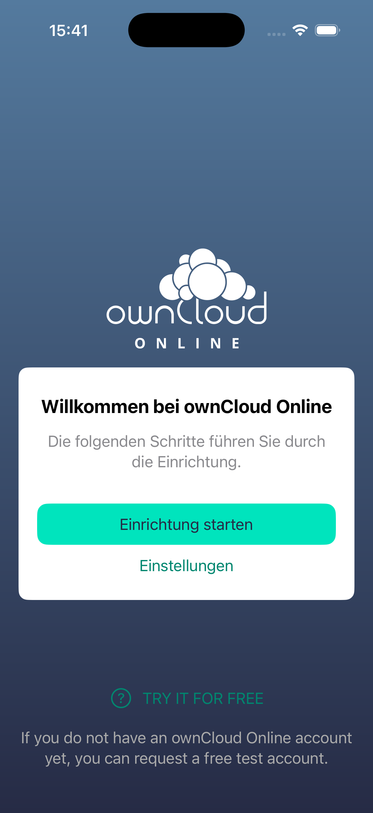
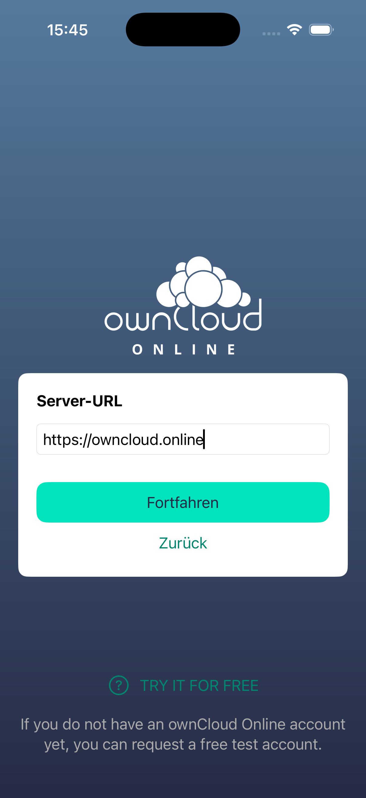
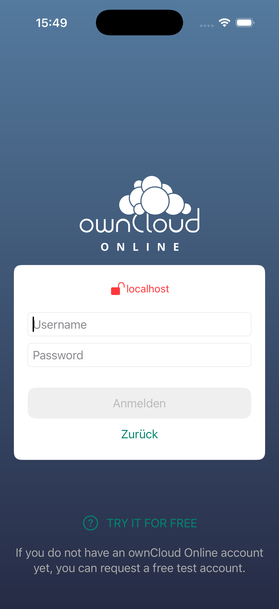
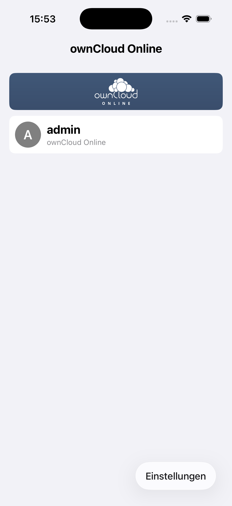
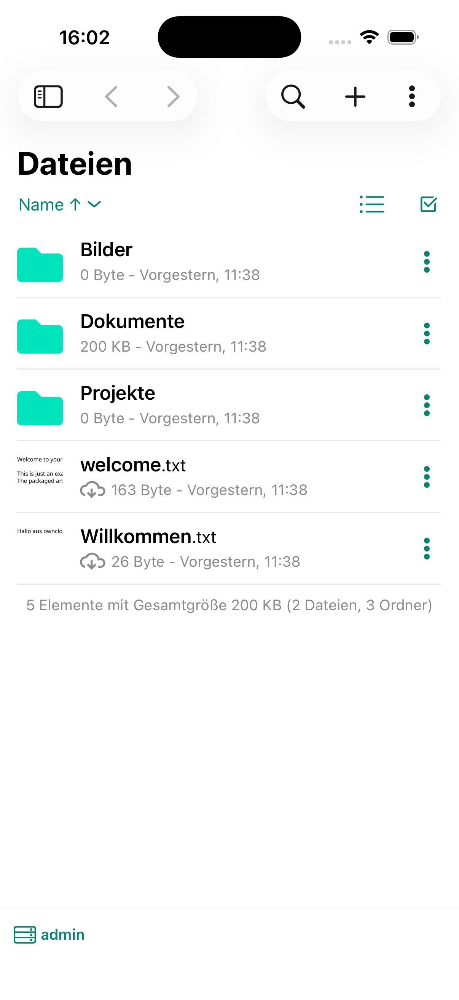

# owncloud.online für iOS

Die iOS-App zu owncloud.online: Dateien ansehen, teilen und über die
Dateien-App von iOS direkt in anderen Programmen weiterverwenden.

| Willkommen | Einrichtung | Anmeldung | Kontenliste | Dateien |
| --- | --- | --- | --- | --- |
|  |  |  |  |  |

Die Screenshots stammen aus der aktuellen owncloud.online-Version der App
(Anmeldebeispiel gegen einen lokalen Testserver).

## Was sie kann

* **Einbindung in die Dateien-App** von iOS — Inhalte stehen jedem Programm zur
  Verfügung, das Dateien öffnen kann
* **Mehrfachauswahl und Ziehen und Ablegen**, auf dem iPad auch zwischen
  Programmen
* **Vorschau** für Bilder, PDF und Videos ohne vollständigen Download
* **Mehrere Konten** gleichzeitig
* **Zertifikatsverwaltung** und Zusammenspiel mit Passwortverwaltungen
* **Helles und dunkles Erscheinungsbild**
* In Swift geschrieben, ausschließlich für iOS

## Bauen

Die Schritte stehen in [SETUP.md](SETUP.md).

## Dokumentation

<https://docs.owncloud.online/>

## Fehler melden

Als [Issue](https://github.com/BWTECH-github/IOS-App/issues), bitte mit Version
von App und Server, iOS-Version, Gerät und den Schritten zum Nachstellen.

**Sicherheitslücken nicht als Issue**, sondern vertraulich an
**security@bw.tech**.

## Übersetzungen

Die Übersetzungen liegen im Repository und werden dort gepflegt — ein Konto bei
einem externen Übersetzungsdienst wird nicht gebraucht.

## Herkunft und Lizenz

Fork der ownCloud-iOS-App, gepflegt von der BW-Tech GmbH für owncloud.online.
Der Dank für die ursprüngliche Arbeit gehört der ownCloud-Gemeinschaft.
Lizenz: [GPLv3](LICENSE).
